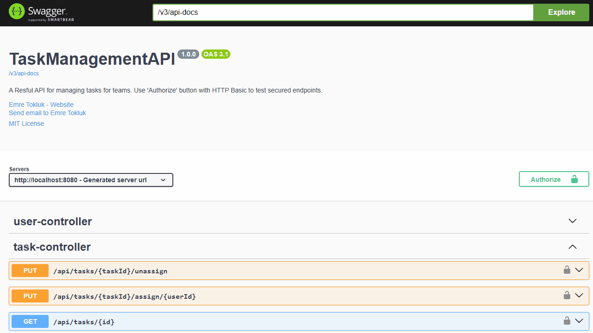

# Task Management API

[](https://www.oracle.com/java/)
[](https://spring.io/projects/spring-boot)
[](https://www.postgresql.org/)
[](https://www.docker.com/)
[](https://opensource.org/licenses/MIT)

A highly secure and production-ready RESTful API for managing user tasks, featuring role-based authorization, comprehensive unit testing, and containerized deployment with PostgreSQL.

## 🎥 API Demo


*Demo showing Swagger UI interactions with the Task Management API*

## ✨ Key Technical Features & Demonstrated Skills

This project showcases mastery of core Java/Spring Ecosystem principles crucial for backend development:

| Category                        | Feature Implemented                         | Technical Skill Demonstrated                                                                                                                                                                            |
|:--------------------------------|:--------------------------------------------|:--------------------------------------------------------------------------------------------------------------------------------------------------------------------------------------------------------|
| **Security & Authorization**    | **Method-Level Security (`@PreAuthorize`)** | Implemented precise access control, ensuring only `ROLE_TEAM_LEADER` can create, update, or delete tasks. Uses HTTP Basic Auth (JWT Ready).                                                             |
| **Data Integrity & Efficiency** | **Custom Paginated APIs**                   | Designed robust, efficient pagination using dedicated `PaginationRequest` DTOs, decoupling the API layer from Spring's `Pageable` interface.                                                            |
| **Testing & Quality**           | **Comprehensive Mockito Testing**           | Achieved full unit test coverage for `TaskService` and `UserService`. Validates complex business logic (e.g., assignment/unassignment, edge-case validation, large offset checks) using isolated mocks. |
| **Data Modeling**               | **Clean DTO & Mapper Architecture**         | Strict separation between persistence entities (`Task`, `User`) and external contracts (Request/Response DTOs) using dedicated Mapper classes.                                                          |
| **Deployment & Infrastructure** | **Docker & PostgreSQL Integration**         | Configured a multi-stage, production-ready environment using **Docker Compose** to manage the Spring Boot application and a dedicated **PostgreSQL** database container.                                |

---

## 🛠️ Technology Stack

* **Language:** Java 17+
* **Framework:** Spring Boot 3.x, Spring Data JPA, Spring Security
* **Database (Dev/Test):** H2 (In-memory)
* **Database (Prod/Deployment):** PostgreSQL
* **Testing:** JUnit 5, Mockito
* **Documentation:** SpringDoc / Swagger UI
* **Deployment:** Docker, Docker Compose

---

## 📦 Local Setup & Deployment

### Prerequisites

You must have **Java 17+** and **Docker Compose** installed locally.

1.  **Clone the Repository:**
    ```bash
    git clone https://github.com/Norwil/task-management.git
    cd task-management
    ```

2.  **Build the Project:** Compile the application and package it into a runnable JAR file.
    ```bash
    ./mvnw clean package -DskipTests
    ```

3.  **Run with Docker Compose (PostgreSQL Environment):**
    The `docker-compose.yml` file will automatically build the `task-api` image, start the `task-postgres` container, and initialize the schema.
    ```bash
    docker-compose up --build
    ```

---

## 🔗 Live Demo & API Access

The application should now be running at `http://localhost:8080`.

### 1. **Access Documentation (Swagger UI)**

Open your browser to: `http://localhost:8080/swagger-ui.html`

### 2. **Authentication & Testing Credentials**

The API uses **HTTP Basic Authentication** enforced by Spring Security.

| Role             | Username   | Password   | Access Rights                              |
|:-----------------|:-----------|:-----------|:-------------------------------------------|
| **TEAM\_LEADER** | `admin`    | `admin123` | Full CRUD access to all endpoints.         |
| **USER**         | `john_doe` | `user123`  | Read-only access (`GET` endpoints only).   |

**To Execute Endpoints:** Click the **Authorize** button in Swagger UI and enter the required credentials.

---

## 📝 Testing Strategy

Unit tests are used to validate core business logic, ensuring robustness and maintainability.

* **Location:** `src/test/java/.../service/*ServiceTest.java`
* **Focus:** **Isolated unit tests** for `TaskService` and `UserService`.
    * Verifies correct hashing (`UserService`).
    * Verifies complex DTO mapping and entity updates.
    * Confirms proper handling of exceptions (`NoSuchElementException`, `IllegalArgumentException`).
* **Tool:** Mockito is used to mock dependencies (`TaskRepository`, `UserRepository`) to guarantee true isolation.

## 📜 License

This project is licensed under the MIT License - see the [LICENSE](LICENSE) file for details.